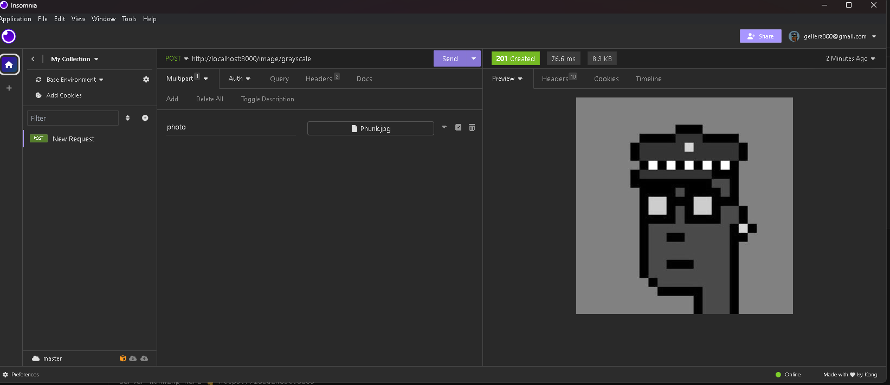
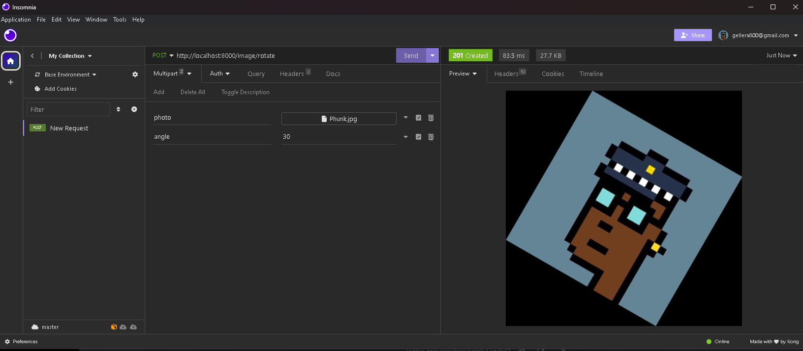
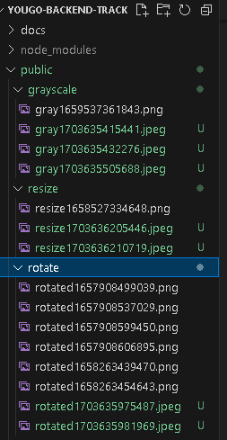

<p align="center">
  <a href="https://github.com/Geller99/YouGo-Backend-Track">
   
  </a>
</p>

<h1 align="center">Reveal API - World Class Image Manipulation in One Click! </h1>

<br>

<p align="center">
  
</p>
<br />

<p align="center"> Reveal API makes for effortless access to image upload, manipulation, storage and downloads! </p>

<div align="center">
  <br />
  <br />
   <a href="/"><strong>Explore the docs! »</strong></a>
   <br/>
  <a href="https://github.com/Geller99/YouGo-Backend-Track/issues/new">Report a Bug</a>
  ·
  <a href="https://github.com/Geller99/YouGo-Backend-Track/issues/new">Request a Feature</a>
  ·
  <a href="https://github.com/Geller99/YouGo-Backend-Track/issues/new">Ask a Question</a>
</div>

<hr/>

## Looking for the documentation? 📝

The API Swagger Spec YAML file can be found [here](https://github.com/Geller99/YouGo-Backend-Track/blob/Kohl/docs/api-docs.yaml) 
<br/>
My Design Choices and Decisions are documented [here](https://github.com/Geller99/YouGo-Backend-Track/blob/Kohl/docs/design-doc.md)
<br/>
Official Project Design Decisions will be documented [here](https://github.com/Geller99/YouGo-Backend-Track/blob/Kohl/docs/moodBoard.md)


Latest version (v0.0.2)

## Features 🚀

- [X] Super Fast Image Processing Speeds
- [X] Industry Standard Accessibility
- [X] Open Source 
- [X] Multiple Manipulation Tiers


## Support Reveal Images API 💖

Feel free to joing our YouGoDevs community and contribute to the original Project Exercises!

### Individuals

Lead Developer - ZenHorace

<br/>

Student        - Geller Micael

### Organizations

YouGo Fullstack Mentoring Group


## Run (Local) and Deploy Commands

First run 
``git clone https://github.com/Geller99/YouGo-Backend-Track`` on your local drive in any directory

Then 
``npm i`` install required dependencies for node, AWS, multer, sharp etc

The Package.json file outlines the available commands for running this server locally

```
 "scripts": {
    "test": "echo \"Error: no test specified\" && exit 1",
    "dev": "ts-node-dev --respawn app.ts",
    "build": "tsc",
    "start": "tsc && node dist/app.js"
  }
```

``npm run dev`` uses tsc-node-dev and the --respawn command to restart the server whenever chaanges are detected in the code base


## Docker Config

Make sure you have a running Docker Daemon, if not, install docker desktop
`https://www.docker.com/products/docker-desktop/`

## Commands
```
Pass Environment variables directly via docker run:

docker run -p 3000:3000 -e VARIABLE_NAME=value yougo-backend-track


Pass .env file to docker via docker run command:

docker run --env-file .env -p 3000:3000 yougo-backend-track

```

## Sample API Calls

Here's a couple examples using a tool like Insomnia/Postman to test the API on localhost



To Rotate an image 
```
file: [Attach your image file here]
angle: enter numerical angle here

```




To Resize an image
```
file: [Attach your image file here]
height: 600
width: 800

```


Define your URL and the specific endpoint you'd like to hit and voila!


## Users and Cloud Image Storage

Reveal API provides custom user storage via AWS S3 for users who wish to customize and store their images

When testing locally, you can attach your own S3 bucket and try out

```
/store, 
/fetchList, 
/fetchImage, 
/ManipulateStore 
```
These endpoints utilize S3 for image storage and retrieval

## Cleanup

When testing the API locally, images are stored in the public folder titled after whatever endpoint they were manipulated with

Remember to clear these periodically after local testing




## License

MIT © [Geller Micael](https://github.com/Geller99)
